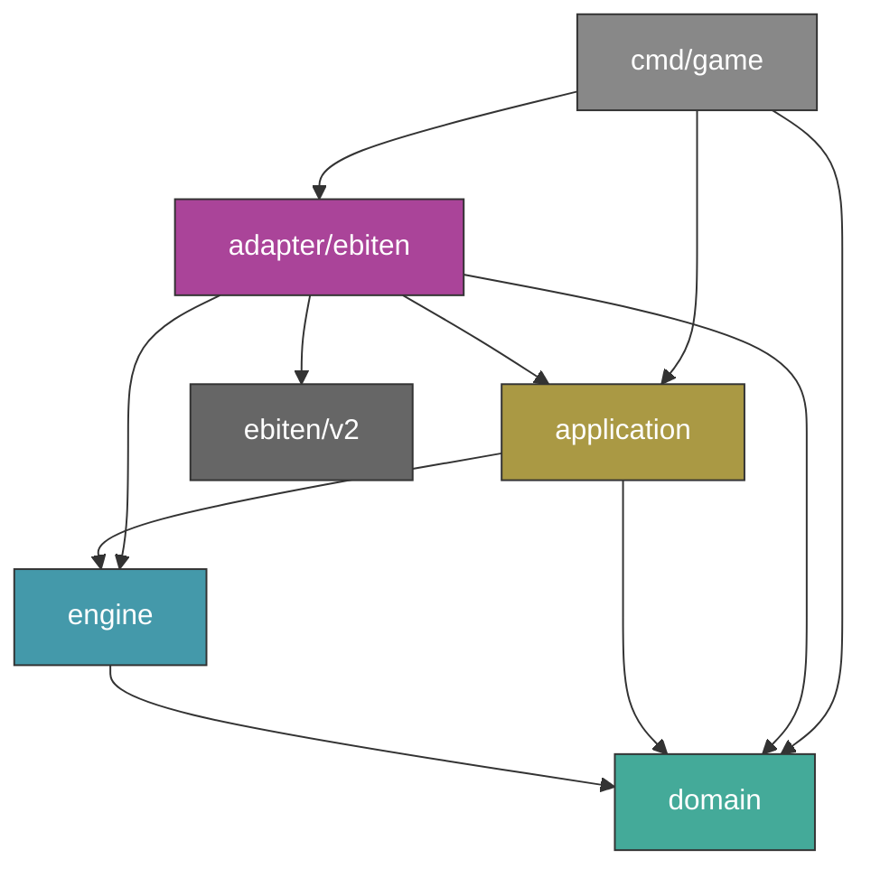
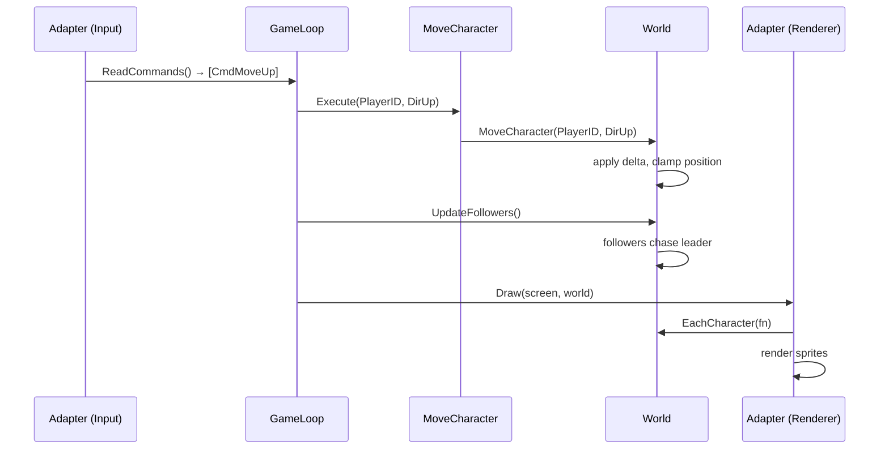

# Dream Walker — Architecture

## Overview

Dream Walker is a 2D adventure game built in Go with Ebiten. The architecture follows clean architecture principles — domain logic is engine-agnostic, and the rendering engine (Ebiten) is a replaceable adapter.

## Dependency Flow

```
domain/          → nothing (stdlib only)
engine/          → domain
application/     → domain, engine
adapter/ebiten/  → domain, engine, application, ebiten/v2
adapter/raylib/  → domain, engine, application, stdlib
cmd/             → adapter, application, domain
```

Domain never imports engine packages. Adapters depend inward. Application may import engine (for the Command type) but never adapters.





## Layers

### Domain (`internal/domain/`)

Pure game rules with zero external imports. This is the heart of the game.

| File | Purpose |
|---|---|
| `world.go` | Aggregate root. Holds all characters and positions. All state mutations go through World. Constants: 800x600 window, 32px tiles, 3.0 move speed. |
| `character.go` | Character model — ID, Name, Type (Player/Pet/NPC), Facing direction, Moving state, Leader (for follower AI). |
| `position.go` | Position with X/Y floats. `Clamp()` keeps entities within bounds. |
| `direction.go` | Direction enum (Up/Down/Left/Right/None). `Delta()` returns unit movement vector. |

Key design decisions:
- World is the aggregate root — all game state access goes through it
- Characters and positions are private maps with accessor methods: `Character(id)`, `Position(id)`, `EachCharacter(fn)`
- Follower AI is built into World via `UpdateFollowers()` — followers track their leader's position

### Engine Interfaces (`internal/engine/`)

Defines the contract between application logic and rendering adapters.

- **Command** — enum of player actions (MoveUp, MoveDown, MoveLeft, MoveRight, Quit)
- **InputReader** — `ReadCommands() []Command`
- **Renderer** — `Draw(screen any, world *World)`
- **Engine** — `Run() error`

The `screen any` parameter lets each adapter use its own image type without leaking engine types into the interface.

### Application (`internal/application/`)

Use cases that coordinate domain operations.

| File | Purpose |
|---|---|
| `game_loop.go` | Routes commands to use cases. Calls `UpdateFollowers()` every frame. Returns true on quit. |
| `move_character.go` | Delegates to `World.MoveCharacter()`. Thin use case — exists for clean separation. |

### Ebiten Adapter (`internal/adapter/ebiten/`)

Full graphical renderer using Ebiten v2.

| File | Purpose |
|---|---|
| `game.go` | Implements Ebiten's `Game` interface. Wires input, game loop, and renderer. Sets up 800x600 resizable window. |
| `input.go` | Maps WASD/Arrow/ESC keys to Command values. |
| `renderer.go` | Draws grid background, player sprite, cat sprite, HUD text. |
| `sprites/player.go` | Loads 4x4 sprite sheet (48x48 frames). 4 directions, 4 frames each. Animates every 60 ticks. |
| `sprites/cat.go` | Loads variable-frame sprite sheet (32x32). Different frame counts per direction (DOWN=3, UP=8, LEFT=4, RIGHT=4). Resets animation on direction change. |
| `helpers/helpers.go` | Utilities: hex color conversion, sprite sheet loading and slicing. |

### Raylib Adapter (`internal/adapter/raylib/`)

Minimal terminal stub. Same architecture, draws colored rectangles instead of sprites. Useful as a reference for how to add a new engine adapter.

## Game Loop Flow

```
1. Adapter.ReadCommands()        →  keyboard input to Command[]
2. GameLoop.ProcessCommands()    →  routes commands to use cases
3. MoveCharacter.Execute()       →  World.MoveCharacter(id, dir)
4. World.UpdateFollowers()       →  followers chase their leader
5. Adapter.Draw()                →  reads world state, renders frame
```

## Assets

```
assets/
  sprites/
    player.png    192x192 sheet → 4 rows x 4 cols of 48x48 frames
    cat.png       variable sheet → 32x32 frames, different count per row
```

## Current State

- Player spawns at center, moves with WASD/Arrows
- Cat follows the player using leader-follower AI
- Both have directional sprite animations
- World boundary clamping prevents walking off-screen
- No map, no camera, no collision, no interaction yet
